<!--
  This is your PROFILE README. It goes in a repo named exactly after your
  username (e.g. github.com/OCTOCAT/OCTOCAT) so GitHub shows it on your profile.
  Replace the ALL-CAPS placeholders. Widths 370/490 keep the portrait and info
  card the same height -- if you change the info card's H, re-match these.
-->

<table>
<tr>
<td valign="top"></td>
<td valign="top"></td>
</tr>
</table>

# Vladislav Ogai

**ML Engineer · Backend Developer**

---

## Projects

### [LLM Opinion Dynamics](https://github.com/ovladisluvv/LLM-opinion-dynamics)
**Description**: Python framework for modeling opinion dynamics in social networks with LLM-based agents, including reproducible experimental setups and comparison with classical consensus models such as DeGroot

### [GradeTrack](https://github.com/ovladisluvv/GradeTrack)
**Description**: Python desktop application with a graphical user interface for retrieving and analyzing university grades from a student portal, calculating average and diploma grades, accounting for retakes, and evaluating eligibility for a diploma with distinction

### [Haskell Chess](https://github.com/ovladisluvv/Haskell-Chess-2026)
**Description**: Haskell implementation of the classic game of Chess with a graphical user interface, supporting both two-player matches and single-player games against a bot

---
## Let's connect

 

<!-- animated contribution graph, refreshed daily by the workflow -->

